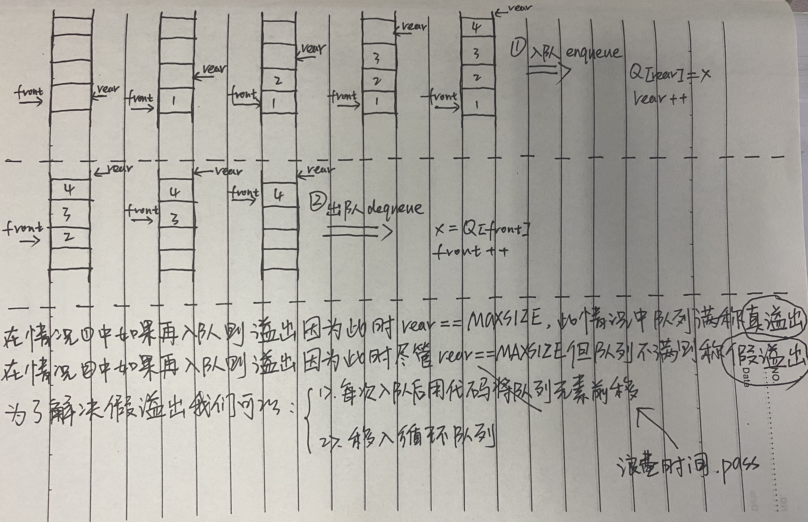
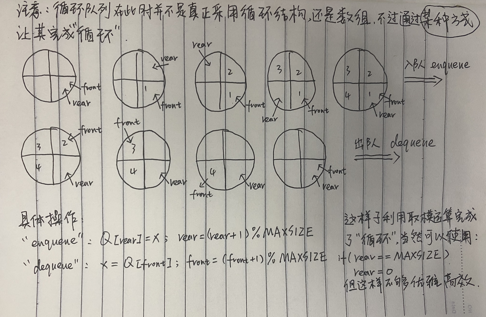

#### 定义

只能在表的一端进行插入运算，在表的另一端进行删除运算的线性表（先进先出）

#### 逻辑结构

与线性表相同，仍为一对一的关系

#### 存储结构

顺序队或链队，以循环顺序队更常见

#### 运算规则

只能在队首和队尾运算，且访问结点时依照先进先出（fifo）的原则

#### 实现方式

掌握入队和出队操作，具体实现依顺序队或链队的不同而不同

#### 常见应用

- 脱机打印输出
- 多用户系统中，多个用户排队分时地循环使用cpu和主存
- 按用户的优先级拍成多个队，每个优先级一个队列
- 实时控制系统中，信号按接收的先后顺序依次处理
- 网络电文传输，按到达的时间先后顺序依次进行

#### 队列的抽象数据类型

```c
ADT Queue {
  // 数据对象：
  D = { ai | ai ∈ ElemSet, i = 1, 2, 3, ..., n, n >= 0 }
  // 数据关系：
  R1 = { <ai-1, ai> | ai - 1, ai ∈ D, i = 2, 3, ..., n  } // 约定其中a1端为队列头，an端为队列尾
}ADT Queue
```

#### 队列基本操作

##### 顺序队列表示

用一维数组base[MAXQSIZE]

```c
#define MAXQSIZE 100
Typedef struct {
  QElemType *base // 初始化的动态分配存储空间，base指向首元素
  int front // 表示队头元素的下标
  int rear // 表示队尾元素的下标
}SqQueue
```

队满：`rear == MAXQSIZE`

队空：`rear == front`

#### 循环队列





循环队列完完全全的利用好了空间，但是如何判断队满和队空呢?

- 另外设置标志区别队满和队空
- 另外设置一个变量记录队列元素个数
- 少使用一个队列的空间

前俩种需要另外开辟空间使用变量来存值判断，第三种则不需要。使用第三种方法判断如下：

队满：`(rear + 1) % MAXQSIZE == front`

队空：`rear == front`
