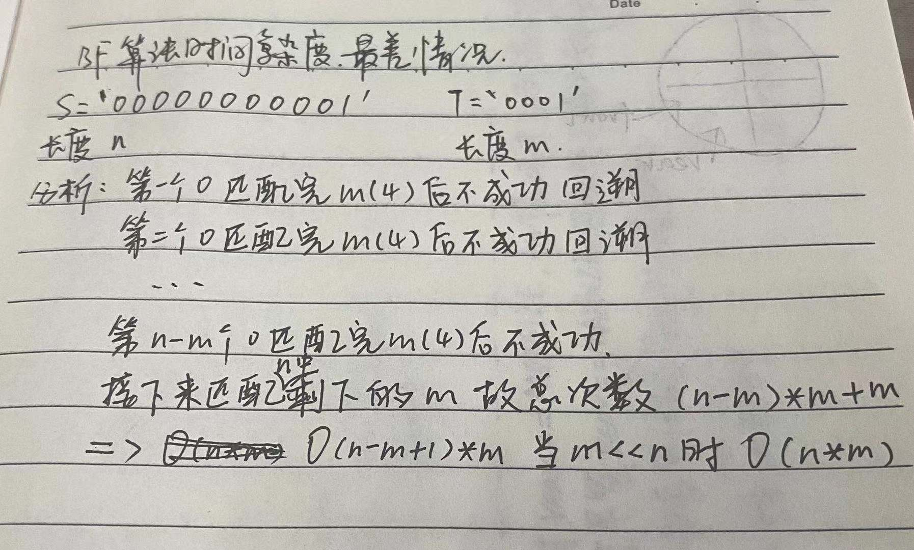

#### 串的类型定义

```c
ADT String {
  D = { ai | ai ∈ CharacterSet, i = 1, 2, ..., n, n >= 0 } // 数据对象
  R1 = { < ai-1, ai > | ai-1, ai ∈ D, i = 1, 2, ..., n }   // 数据关系
}ADT String
```

#### 基本操作

1. StrAssign(&T, chars)			// 串赋值
2. StrCompare(S, T)		        // 串比较
3. StrLength(S)                        // 串长
4. Concat(&T, S1, S2)              // 串合并
5. SubString(&Sub, S, pos, len) // 求子串
6. StrCopy(&T, S)                     // 串拷贝
7. StrEmpty(S)                         // 空串
8. ClearString(&S)                   // 清空串 
9. **Index(S, T, pos)**                  // 子串的位置
10. Replace(&S, T, V)               // 串替换        
11. StrInsert(&S, pos, T)          // 子串插入
12. StrDelete(&S, pos, len)      // 子串删除
13. DestoryString(&S)             // 串销毁

#### 存储结构

串中元素逻辑关系与线性表相同，串可以采用与线性表相同的存储结构。同样的串可以使用顺序存储结构（顺序串），也可以使用链式存储结构（链串）。

#### 顺序串（常用，因为插入删除操作较少）

```c
#define MAXSIZE 255
typedef struct {
  char ch[MAXLEN + 1]
  int length;
}SString;
```

#### 链串 -- 块链结构

**采用链式结构的时候如果data域只放置一个char会导致空间的浪费，可以在data域多放置几个char，这种data域被称作块chunk**

```c
#define CHUNKSIZE 80
typedef struct Chunk {
  char ch[CHUNKSIZE]
  struct Chunk *next
}Chunk
  
typedef struct {
  Chunk *head, *tail
  int curlen
}LString
```

#### 串的操作

##### 串的模式匹配算法

目的：**确定主串中所含子串第一次出现的位置**

应用：**搜索引擎、拼写检查、语言翻译、数据压缩**

种类：**BF算法（Brute-Force暴力破解法，又称古典的、经典的、朴素的、穷举的）、KMP算法（特点速度快）**

##### BF算法

```c
// BF思想：以子串为模式依次从主串第一位开始向后匹配（回溯）
int IndexBF(SString S, SString T) {
  // 将主串的第pos个字符和模式串的第一个字符比较；若相等，继续逐个比较后续字符；若不等，从主串的下一个字符起，重新与模式串的第一个字符比较
  // 直到主串的一个连续子串字符序列与模式串相等。返回值为S中与T匹配的子序列第一个字符的序号，即匹配成功；否则，匹配失败，返回值为0
  int i = 1;
  int j = 1;
  
  while(i <= S.length && j <= T.length) {
    if(s.ch[i] == t.ch[i]) {
      // 主串和子串依次匹配下一个字符
      ++i;
      ++j;
    }else{
      // 主串、子串指针回溯重新开始下一次匹配
      i = i - j + 2; // 因为是从1开始所以加2，从0开始加1即可移动到下一个位置
      j = 1;
    }
  }
  
  if(j >= T.length) {
    // 返回匹配的第一个字符下标
    return i - T.length
  }else{
    // 匹配不成功返回0
    return 0
  }
}
```

最好情况：O(m)

最坏情况：

##### KMP算法

寻找模式串索引j（next[j]）的方法：

1. j = 1 时，next[j] = 0
2. max{ k|1 < k < j, 且 p1...pk-1 = pj-k+1...pj-1(即前缀和后缀相等的集合中取最大值) }
3. 其他情况（非1、2），next[j] = 1

```c
// KMP思想：利用已经部分匹配的结果加快模式串的滑动速度，且主串S的指针不必回溯！可提速到O(n+m) 
int Index_KMP(SString S, SString T, int pos) {
  i = pos;
  j = 1;
  
  while(i < S.length && j < T.length) {
    if(j == 0 || S.ch[i] == T.ch[j]) {
      i ++;
      j ++;
    }else{
      j = next[j] // i 不变，j 后退
    }
  }
  
  if(j > T.length) {
    return i - T.length
  }else{
    return 0
  }
}

void get_next(SString T, int &next[]) {
  i = 1;
  next[1] = 0;
  j = 0;
  
  while(i < T.length) {
    if(j == 0 || T.ch[i] == T.ch[j]) {
      ++i;
      ++j;
      next[i] = j;
    }else{
      j = next[j];
    }
  }
}

// todo 根据next[j] 求出 nextVal[j] 主要是为了提高模式串各个元素都相等的情况
```

![KMP next[j]分析 1](./images/KMP next[j]分析 1.jpg)

![KMP next[j]分析 2](./images/KMP next[j]分析 2.jpg)
